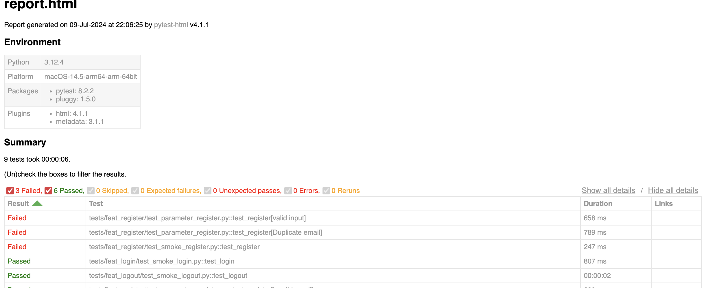

# API Test for KasirDemo

This project contains automated API tests for [kasirdemo.belajarqa.com](https://kasirdemo.belajarqa.com) using `pytest` and `requests`.

## Project Structure

```
api-test-kasirdemo/
├── venv/
├── tests/
│   ├── feat_login/
│   │   ├── __init__.py
│   │   ├── smoke_login.py
│   ├── feat_register/
│   │   ├── __init__.py
│   │   ├── smoke_register.py
│   ├── __init__.py
├── requirements.txt
├── README.md
```

## Prerequisites

- Python 3.6+
- `pip`
- `virtualenv`

## Setup

1. **Clone the repository:**

    ```bash
    git clone https://github.com/derryderajat/api-test-kasirdemo.git
    cd api-test-kasirdemo
    ```

2. **Create a virtual environment and activate it:**

    ```bash
    python -m venv venv
    source venv/bin/activate  # On Unix or MacOS
    # or
    venv\Scripts\activate  # On Windows
    ```

3. **Install the dependencies:**

    ```bash
    pip install -r requirements.txt
    ```

## Running the Tests

To run the tests and generate an HTML report, use the following command:

```bash
pytest --html=report.html --self-contained-html
```

## Viewing the Report

After running the tests, you can open the `report.html` file in your web browser to view the test results.

## Example Report Preview



## Writing Tests

Tests are written using `pytest` and the `requests` library. Here's an example test function:

```python
import requests

def test_api_response_time():
    url = 'https://kasirdemo.belajarqa.com/api/endpoint'  # Replace with the actual endpoint
    response = requests.post(url, json={"key": "value"})
    assert response.status_code == 200
    assert response.elapsed.total_seconds() * 1000 < 500, "Response time exceeds 500 ms"
```

## Contributing

Feel free to open issues or submit pull requests if you have any improvements or bug fixes.

## License

This project is licensed under the MIT License - see the [LICENSE](LICENSE) file for details.